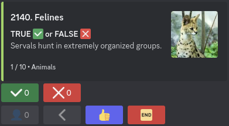
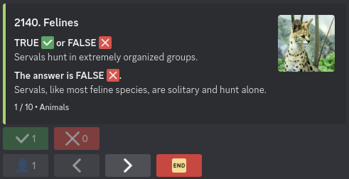

# QuipoQuiz Discord Bot

Bot Discord to play [QuipoQuiz](https://quipoquiz.com) with friends.

> [!IMPORTANT]
> 1. **We are not affiliated with QuipoQuiz.**
> 2. The bot is not hosted, you need to host it yourself.

## Visuals (Spoiler)

  
Category information

Command used: `/category`

  
Question not revealed

Command used: `/play`

  
Question revealed

Command used: `/play`

  
Rank end game

Command used: `/play`

## Multiplatform

| Platform | Build Status | Reason                                                                                                                                                                                                                                                                                |
|----------|--------------|---------------------------------------------------------------------------------------------------------------------------------------------------------------------------------------------------------------------------------------------------------------------------------------|
| JVM      | ✅            |                                                                                                                                                                                                                                                                                       |
| JS       | ✅            |                                                                                                                                                                                                                                                                                       |
| WasmJS   | ❌            | [i18n4k](https://github.com/comahe-de/i18n4k/issues/68), [kord](https://github.com/kordlib/kord/pull/855), [apollo](https://www.apollographql.com/docs/kotlin/#multiplatform)                                                                                                         |
| WasmWasi | ❌            | [kotlin-logging](https://github.com/oshai/kotlin-logging), [i18n4k](https://github.com/comahe-de/i18n4k), [kord](https://github.com/kordlib/kord), [apollo](https://www.apollographql.com/docs/kotlin/#multiplatform), [kotlinx-datetime](https://github.com/Kotlin/kotlinx-datetime) | 

### Native

#### Tier 1

_[Reference](https://kotlinlang.org/docs/native-target-support.html#tier-1)_

| Platform          | Build Status | Reason |
|-------------------|--------------|--------|
| macosX64          | ✅            |        |
| macosArm64        | ✅            |        |
| iosSimulatorArm64 | ✅            |        |
| iosX64            | ✅            |        | 

#### Tier 2

_[Reference](https://kotlinlang.org/docs/native-target-support.html#tier-2)_

| Platform              | Build Status | Reason                                                                                                                                                              |
|-----------------------|--------------|---------------------------------------------------------------------------------------------------------------------------------------------------------------------|
| linuxX64              | ❌            | [apollo](https://www.apollographql.com/docs/kotlin/#multiplatform)                                                                                                  |
| linuxArm64            | ❌            | [i18n4k](https://github.com/comahe-de/i18n4k), [kord](https://github.com/kordlib/kord/pull/855), [apollo](https://www.apollographql.com/docs/kotlin/#multiplatform) |
| watchosSimulatorArm64 | ✅            |                                                                                                                                                                     |
| watchosX64            | ❌            | [kord](https://github.com/kordlib/kord/pull/855), [apollo](https://www.apollographql.com/docs/kotlin/#multiplatform)                                                | 
| watchosArm32          | ❌            | [kotlin-logging](https://github.com/oshai/kotlin-logging), [kord](https://github.com/kordlib/kord/pull/855)                                                         |
| watchosArm64          | ✅            |                                                                                                                                                                     |
| tvosSimulatorArm64    | ✅            |                                                                                                                                                                     |
| tvosX64               | ✅            |                                                                                                                                                                     | 
| tvosArm64             | ✅            |                                                                                                                                                                     |
| iosArm64              | ✅            |                                                                                                                                                                     |

#### Tier 3

_[Reference](https://kotlinlang.org/docs/native-target-support.html#tier-3)_

| Platform           | Build Status | Reason                                                                                                                                                                                                                         |
|--------------------|--------------|--------------------------------------------------------------------------------------------------------------------------------------------------------------------------------------------------------------------------------|
| androidNativeArm32 | ❌            | [i18n4k](https://github.com/comahe-de/i18n4k), [kord](https://github.com/kordlib/kord/pull/855), [apollo](https://www.apollographql.com/docs/kotlin/#multiplatform)                                                            |
| androidNativeArm64 | ❌            | [i18n4k](https://github.com/comahe-de/i18n4k), [kord](https://github.com/kordlib/kord/pull/855), [apollo](https://www.apollographql.com/docs/kotlin/#multiplatform)                                                            |
| androidNativeX86   | ❌            | [i18n4k](https://github.com/comahe-de/i18n4k), [kord](https://github.com/kordlib/kord/pull/855), [apollo](https://www.apollographql.com/docs/kotlin/#multiplatform)                                                            |
| androidNativeX64   | ❌            | [i18n4k](https://github.com/comahe-de/i18n4k), [kord](https://github.com/kordlib/kord/pull/855), [apollo](https://www.apollographql.com/docs/kotlin/#multiplatform)                                                            | 
| mingwX64           | ❌            | [apollo](https://www.apollographql.com/docs/kotlin/#multiplatform)                                                                                                                                                             |
| watchosDeviceArm64 | ❌            | [kotlin-logging](https://github.com/oshai/kotlin-logging), [i18n4k](https://github.com/comahe-de/i18n4k), [kord](https://github.com/kordlib/kord/pull/855), [apollo](https://www.apollographql.com/docs/kotlin/#multiplatform) |

## Usage

> [!NOTE]
> You need to have a
> [Discord bot](https://discord.com/developers/applications) and a
> [QuipoQuiz](https://quipoquiz.com) token.

- [Build the project](DEVELOPERS.md#build) for the target platform.
- [Run the bot](DEVELOPERS.md#run).

